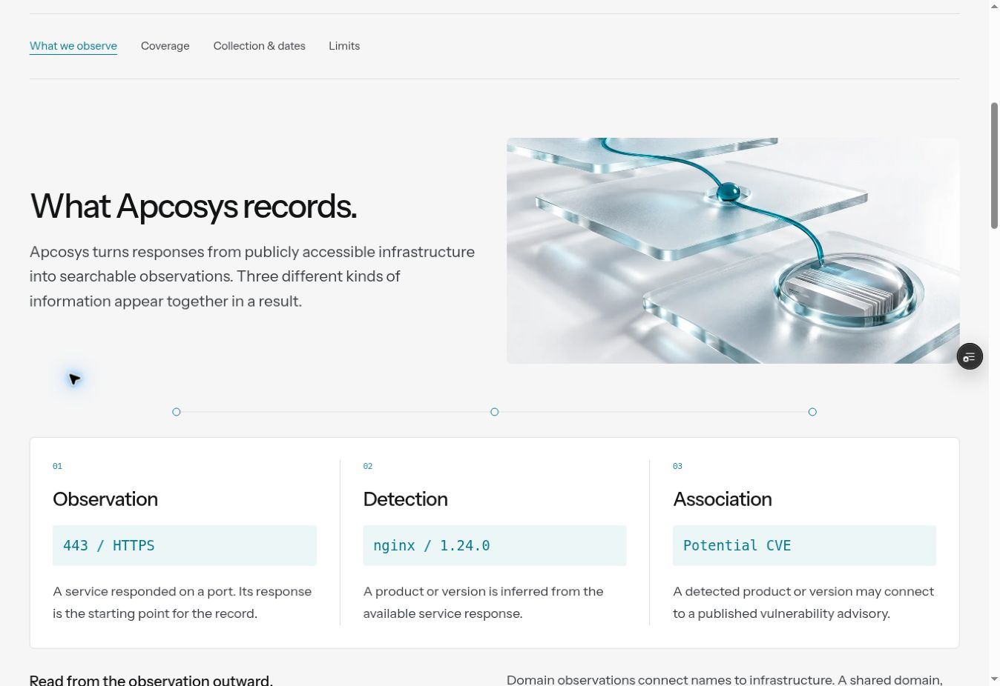
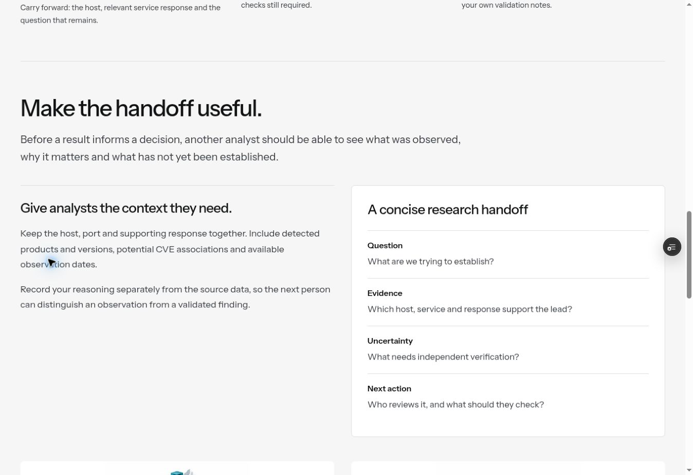

# Внутренние страницы: типографика и подача контента

## Что было не так

Предыдущая версия выровняла сетку, но оставила монотонный порядок чтения: заголовок слева, вводный абзац справа, ниже ещё несколько похожих строк. Заголовки, примеры и пояснения слабо отличались по значимости. Это видно на свежих снимках [методологии до изменений](editorial-readability-2026-10-10/type-before.jpg) и [About до изменений](editorial-readability-2026-10-10/about-before.jpg), снятых в начале этой работы с коммита `2070fc9`.

## Что изменено

1. **Типографика.** Заголовок и введение теперь читаются сверху вниз. H2 — 34–48 px на десктопе, введение — 19–22 px, основной текст — 18 px с интерлиньяжем 1.7, примечания — 15 px. На телефоне основной текст 17 px. Каждый заголовок остаётся рядом со своим объяснением.
2. **Группировка.** Длинные таблицеподобные строки превращены в законченные смысловые группы. Сравнения объединены общей поверхностью с одинаковыми внутренними отступами и разделителями. Между разделами — пространство и тонкая линия на общей сетке сайта.
3. **Изображения.** Созданы три самостоятельные иллюстрации: исследование инфраструктуры, связь слоёв данных, границы сканирования. Они встроены в About, Data & Methodology и Responsible Scanning. У связанных материалов появились компактные изображения соответствующих страниц.
4. **Юридические документы.** Колонка ограничена 720 px, основной текст — 18 px на десктопе и 17 px на телефоне. Заголовки разделов отделены линиями и увеличенными отступами; активный пункт оглавления заметнее. Полные исходные тексты шести документов сохранены.
5. **Согласованность.** Общая ширина сайта, одинаковые первые экраны, двойные кнопки, исходные GSAP-демонстрации и механика мягких переходов сохранены.

## Проверка по страницам

Снимки ниже сделаны в текущем проходе на Preview `5097b18`. Они показывают основную переработку. После просмотра дополнительно исправлены наследовавшийся нулевой левый отступ в белых блоках Teams/Methodology, разделители сравнений, приоритет размеров основного текста и размер примечания API. Для этих изменений выполнена отдельная проверка. Финальные снимки [методологии](editorial-readability-2026-10-10/final-methodology.jpg) и [Teams](editorial-readability-2026-10-10/final-teams.jpg) сделаны на коммите `53106cc`.

| Шаг | Страница и снимок                                                                            | Результат проверки                                                                                                                |
| --- | -------------------------------------------------------------------------------------------- | --------------------------------------------------------------------------------------------------------------------------------- |
| 1   | [Search & Investigation](editorial-readability-2026-10-10/typography-search-proof.jpg)       | Введение связано с заголовком. Три исходных типа запроса собраны вместе, примеры выделены цветом.                                 |
| 2   | [Data & Methodology](editorial-readability-2026-10-10/type-after.jpg)                        | Иллюстрация объясняет связь слоёв; наблюдение, детекция и ассоциация читаются как единая последовательность.                      |
| 3   | [Monitoring](editorial-readability-2026-10-10/monitoring-after.jpg)                          | У каждого изменения видны пример, исследовательский вопрос и следующий шаг.                                                       |
| 4   | [Bug Bounty](editorial-readability-2026-10-10/bounty-after.jpg)                              | Четыре шага образуют последовательную сетку 2 × 2, а не разорванные строки.                                                       |
| 5   | [Vulnerability Research](editorial-readability-2026-10-10/vulnerability-after.jpg)           | Продукт, распространение, потенциальная экспозиция и проверка разнесены по понятным группам.                                      |
| 6   | [OSINT](editorial-readability-2026-10-10/type-osint-1042.jpg)                                | Ход исследования отделён от примера заметки. Наблюдения и предположения остаются различимыми.                                     |
| 7   | [Teams](editorial-readability-2026-10-10/teams-after.jpg)                                    | Объяснение отделено от образца передачи исследования. Найденный на снимке тесный левый край образца исправлен в финальной правке. |
| 8   | [API](editorial-readability-2026-10-10/api-after.jpg)                                        | Инструкция и пример находятся рядом; шрифт кода увеличен. Шаблон по-прежнему обозначен как иллюстративный.                        |
| 9   | [Pricing](editorial-readability-2026-10-10/pricing-after.jpg)                                | Стоимость запросов и вопросы об использовании визуально различаются. В таблицах улучшены вертикальные отступы и чтение строк.     |
| 10  | [About, тёмная тема](editorial-readability-2026-10-10/editorial-dark-1038.jpg)               | Новая иллюстрация формирует визуальный центр. Холодная палитра и читаемость сохраняются в тёмной теме.                            |
| 11  | [Responsible Scanning](editorial-readability-2026-10-10/scanning-after.jpg)                  | Изображение границы связано с содержанием. Три типа собираемой информации объединены в компактный блок.                           |
| 12  | [Contact](editorial-readability-2026-10-10/contact-after.jpg)                                | Темы выглядят как выбираемые области. Форма отделена от выбора темы и пояснений.                                                  |
| 13  | [Юридические страницы: Privacy Policy](editorial-readability-2026-10-10/type-legal-1045.jpg) | Визуально проверено чтение длинного раздела; все шесть документов дополнительно проверены автоматически.                          |

## Иллюстрации

Созданы встроенным инструментом imagegen; это концептуальные изображения, а не скриншоты или точные схемы продукта. Файлы: `public/assets/editorial/evidence.webp`, `investigation.webp`, `scope.webp` и их версии `-600.webp`. Основные версии 1200 × 800, мобильные 600 × 400. Размер одного файла — 17–72 КБ. Изображения загружаются лениво, имеют alt и заранее зарезервированное соотношение сторон. Текст не наложен на изображение.

Промпты и ограничения сохранены в [EDITORIAL-IMAGE-PROMPTS.md](EDITORIAL-IMAGE-PROMPTS.md).

## Проверки и ограничения

- Полный проход из 103 браузерных тестов завершён успешно: одинаковые первые экраны, читаемость, внутренние ссылки, форма, шесть юридических текстов, печать, переключения, переходы и доступность 19 маршрутов в двух темах.
- Финальный проход: 30 из 30 тестов читаемости, адаптивной вёрстки и общей сетки прошли. Вместе с основным проходом проверены 115 различных сценариев (повторяющиеся тесты посчитаны один раз).
- Сборка и проверка исходных шести GSAP-модулей проходят; новые изображения не увеличивают начальный JS-пакет.
- Визуальные снимки сделаны в Chromium на десктопе. Узкие экраны и увеличение текста проверены браузерными тестами, а не отдельным исследованием с пользователями.
- Axe-проверки не равнозначны полной сертификации WCAG. Внешний поиск, реальный API, оплата и отправка писем не проверялись как действующие серверные функции.
- Новые факты о продукте и юридические формулировки не добавлялись. Эта работа меняет подачу существующего содержания.
