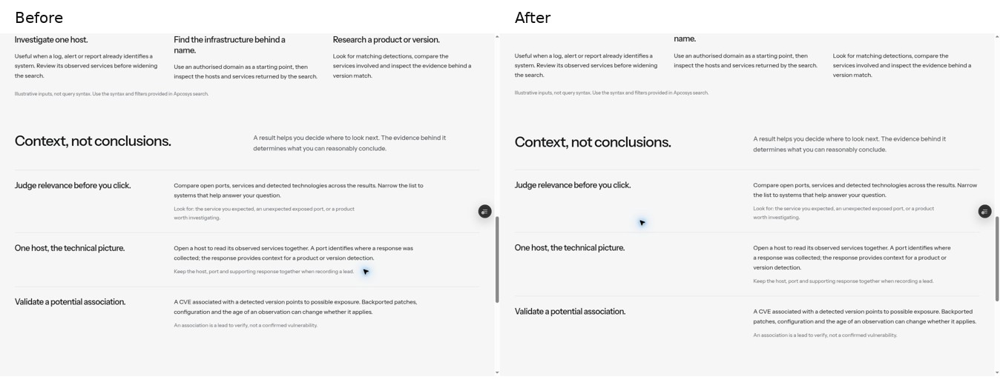
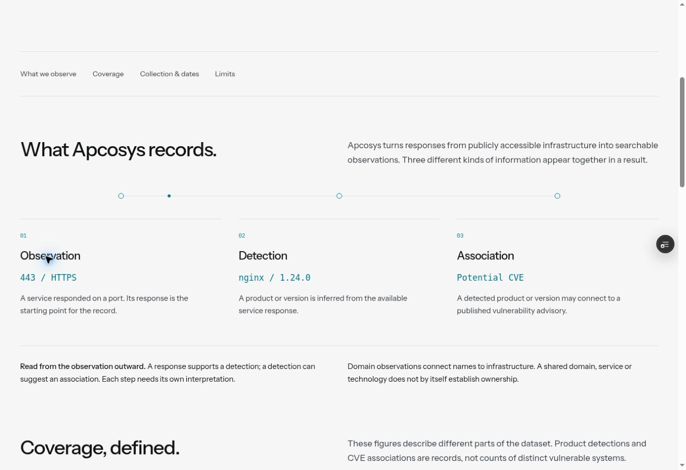
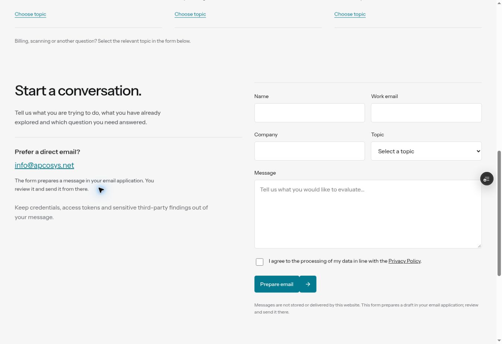
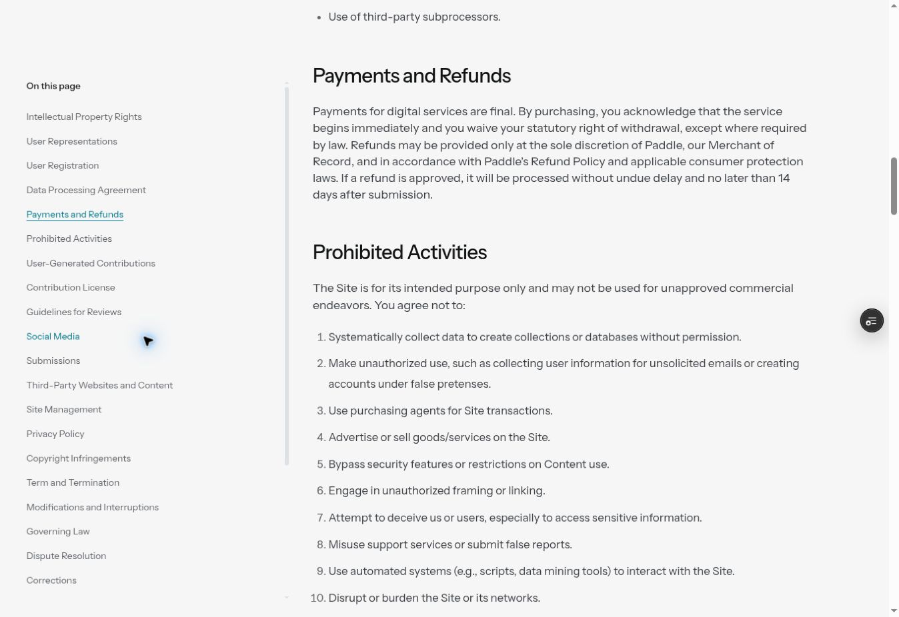

# Глобальный аудит внутренних страниц — 10 октября 2026

Проверены 12 продуктовых и корпоративных страниц и 6 документов. Задача: сделать переход от раздела к разделу предсказуемым для глаза, сохранить содержательную иерархию и убрать случайные смещения. Это аудит интерфейса клиентского preview; он не подтверждает работу внешнего продукта, API или коммерческих условий.

## Главный вывод

Общая внешняя ширина уже работала. Проблема находилась внутри: вводный абзац использовал половину сетки, строки с пояснениями — треть, а отдельные колонки добавляли ещё 32–64 px отступа. На странице поиска начало текста смещалось с **690,84 px до 473,88 px**. После исправления оба текста начинаются с **690,84 px** на том же viewport. Координаты измерены в опубликованном preview, снимки сделаны в текущем аудите.

Сильные стороны сохранены: единый светлый фон, фирменная палитра, отдельные иллюстрации страниц, умеренная длина абзацев, рабочие примеры с явным обозначением демонстрационных данных. Большие повторяющиеся декоративные сцены не добавлялись.

## Что исправлено

1. **Непрерывная линия чтения.** Заголовок слева, пояснение справа; строки ниже, пример API, командный сценарий и форма контакта используют ту же центральную границу. Вложенные отступы у дат, передачи контекста, лимитов и сканирования убраны.
2. **Предсказуемая иерархия.** Сравнение планов, пакеты токенов и командный сценарий получили общий компонент заголовка. Переключатель оплаты привязан к правой колонке. Пакеты токенов занимают полноценную двухколоночную сетку.
3. **Естественные ряды.** Заголовки и описания соседних карточек выравниваются по высоте автоматически. Длинный заголовок больше не сдвигает только свой абзац вниз. На телефонах карточки читаются последовательно; абзацы нумерованных шагов возвращены к левому краю страницы.
4. **Ритм и группировка.** Межсекционные интервалы увеличены умеренно; связанные пояснения объединены верхней линией. Контактная форма вписана в общий фон, поля остаются различимыми. В тарифах устранено случайное сужение пакетов. Финальные действия начинаются на общей линии правой колонки.
5. **Навигация.** Оглавления показывают текущий раздел. Вместо выбора случайного пересекающегося заголовка используется положение у верхней границы чтения; это работает внутри длинных разделов и при прокрутке назад. Также устранён двойной отступ якорей: место под закреплённую шапку уже выделено на уровне страницы. Юридические тексты и их редакционные даты сохранены.
6. **Осмысленное движение.** В методологии компактная canvas-линия связывает Observation → Detection → Association. Один спокойный проход примерно за 4,2 секунды, затем остановка. Вне экрана и при reduced motion проигрывание отсутствует. Текст несёт весь смысл без canvas. Существующие GSAP-сцены и мягкое изменение высоты интерактивных панелей сохранены.

## Постраничная проверка

| №   | Страница                                                          | Находка и действие                                                                                                                   | Состояние после проверки                                                            |
| --- | ----------------------------------------------------------------- | ------------------------------------------------------------------------------------------------------------------------------------ | ----------------------------------------------------------------------------------- |
| 1   | [Search & Investigation](audit-2026-10-10/01-search.jpg)          | Убрано смещение вводного текста относительно поясняющих строк; выровнены абзацы трёх способов начать запрос.                         | Исправлено; продуктовый пример сохранён.                                            |
| 2   | [Data & Methodology](audit-2026-10-10/02-methodology.jpg)         | Сняты лишние боковые отступы уровней данных и блока дат; выровнены карточки; добавлена компактная связь уровней.                     | Читается последовательно; цифры остаются помечены как preview.                      |
| 3   | [Monitoring](audit-2026-10-10/03-monitoring.jpg)                  | Общая сетка заголовков, одинаковый старт описаний изменений и выровненные дальнейшие шаги.                                           | Исправлено; концептуальный статус явно сохранён.                                    |
| 4   | [Bug Bounty](audit-2026-10-10/04-bug-bounty.jpg)                  | Нумерованные пояснения поставлены на общую линию; на телефоне снят лишний отступ тела текста.                                        | Исправлено; границы разрешённого исследования сохранены.                            |
| 5   | [Vulnerability Research](audit-2026-10-10/05-vulnerability.jpg)   | Убрана отдельная внутренняя колонка под абзацы; номера включены в заголовки, тексты начинаются по сетке.                             | Исправлено; предупреждение о различии версии и подтверждённой уязвимости сохранено. |
| 6   | [OSINT & Threat Investigation](audit-2026-10-10/06-osint.jpg)     | Заголовок, пояснение и пример заметки согласованы по общей сетке; отдельная рамка заметки оставлена как граница примера.             | Иерархия проверена; наблюдения и гипотезы разделены.                                |
| 7   | [Teams](audit-2026-10-10/07-teams.jpg)                            | Общий заголовок сценария, снят лишний отступ передачи контекста; исправлен преждевременный перенос в одну колонку на 768 px.         | Исправлено; интерактив проверен.                                                    |
| 8   | [API](audit-2026-10-10/08-api.jpg)                                | Пояснение и код совмещены по горизонтали; визуальная проверка дополнительно обнаружила и устранила 30 px верхнего отступа окна кода. | Исправлено; request/response и копирование сохранены.                               |
| 9   | [Pricing](audit-2026-10-10/09-pricing.jpg)                        | Переключатель оплаты, пояснения, сравнение и пакеты токенов приведены к общей системе.                                               | Исправлено; четыре сравниваемых плана остаются отдельной сеткой.                    |
| 10  | [About](audit-2026-10-10/10-about.jpg)                            | Описания принципов совмещены с вводным текстом; связанные ссылки не получают двойной верхний интервал.                               | Исправлено; короткая последовательность продукта сохранена.                         |
| 11  | [Responsible Scanning](audit-2026-10-10/11-scanning.jpg)          | Снято боковое смещение правой колонки, выровнены инструкции и шаги запроса исключения.                                               | Исправлено; контактные действия проверены.                                          |
| 12  | [Contact](audit-2026-10-10/12-contact.jpg)                        | Темы и поля выровнены; форма больше не добавляет самостоятельный внутренний край; на планшете поля занимают всю ширину.              | Исправлено; форма подготавливает письмо, не утверждает его отправку.                |
| 13  | [API & Data License Agreement](audit-2026-10-10/13-api-terms.jpg) | Проверены читательская колонка, заголовки, оглавление и локальные переходы.                                                          | Удачная сетка сохранена; навигация улучшена.                                        |
| 14  | [Cookie Policy](audit-2026-10-10/14-cookies.jpg)                  | Проверены положение действий, переход к настройкам cookies и единый поток документа.                                                 | Проверено; настройки доступны из документа.                                         |
| 15  | [Data Collection Policy](audit-2026-10-10/15-data-collection.jpg) | Проверены списки и короткая структура документа.                                                                                     | Проверено; исходный текст сохранён.                                                 |
| 16  | [Data Processing Agreement](audit-2026-10-10/16-dpa.jpg)          | Проверены многоуровневая типографика, строки текста и оглавление.                                                                    | Проверено; исходный текст сохранён.                                                 |
| 17  | [Privacy Policy](audit-2026-10-10/17-privacy.jpg)                 | Проверены длинные разделы и ограниченная высота оглавления.                                                                          | Проверено; текущий раздел определяется точнее.                                      |
| 18  | [Terms & Conditions](audit-2026-10-10/18-terms.jpg)               | Проверены 27 разделов, переход внутрь длинного текста и возврат к предыдущим разделам.                                               | Проверено; активный раздел соответствует месту чтения.                              |

## Почему сетки не стали одинаковыми внутри каждого элемента

Общая линия нужна основному тексту. Три сопоставляемых признака, четыре тарифных плана и компактный интерфейс продукта решают другие задачи. Их локальные сетки сохранены, но внешние края, интервалы и уровни типографики согласованы. Юридические документы остаются в более узкой колонке до 760 px рядом с оглавлением; растягивать договор на всю ширину маркетинговой страницы было бы неудобно.

## Проверка и границы выводов

Пройдено **111 различных браузерных тестов** в итоговой совокупности проверок. `npm run check` и сборка проекта проходят.

- Автоматически измерены общие внешние края 19 маршрутов на 320, 768, 1440, 1920 и 2560 px; внутренние текстовые линии 12 страниц — на 768, 1001, 1440 и 1920 px.
- Проверены одинаковые первые экраны на 12 ширинах от 320 до 1920 px и увеличение текста до 200%.
- Проверены переносы заголовков карточек, форма на планшете, все состояния мониторинга, мобильная таблица API, якоря и предзаполнение контакта.
- Проверены исходные GSAP-фильмы, непрерывное изменение высоты, переходы страниц, reduced motion, одноразовое проигрывание новой canvas-связи и отсутствие наложения двух текстовых состояний.
- Axe-проверки всех 19 маршрутов в светлой и тёмной темах не обнаружили нарушений в проверяемом наборе правил. Это не заявление о полной WCAG-сертификации или проверке всех комбинаций экранных дикторов.
- Полнота шести юридических текстов, печать и внутренние ссылки проверены автоматическими тестами. Юридические формулировки не пересматривались.
- Снимки относятся к живой сборке первого прохода `f0eb779` в текущем аудите. Обнаруженные после снимков отступ окна API и планшетный breakpoint Teams исправлены в завершающем коммите и проверены отдельно. Новая canvas-связь также ограничена одним проходом после визуального просмотра.
- Внешние поиск, авторизация, реальные API-запросы, оплата и доставка писем не входят в проверку клиентской вёрстки. Исходные неопределённости контента перечислены в `INNER-PAGES-DEPTH-2026-10-10.md` и `LEGAL-PAGES-2026-10-10.md`; новая функциональность не выдумывалась.
