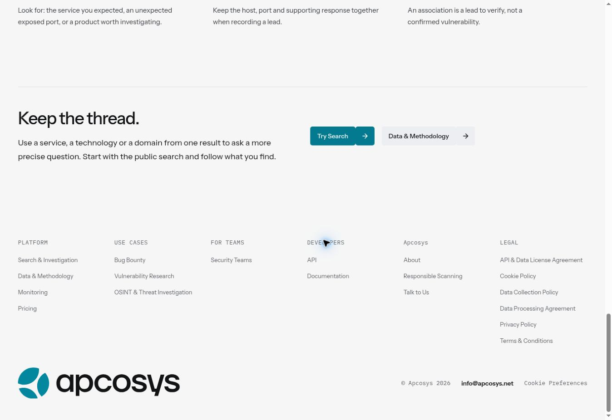
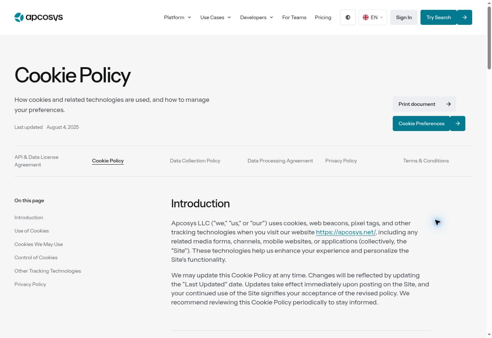
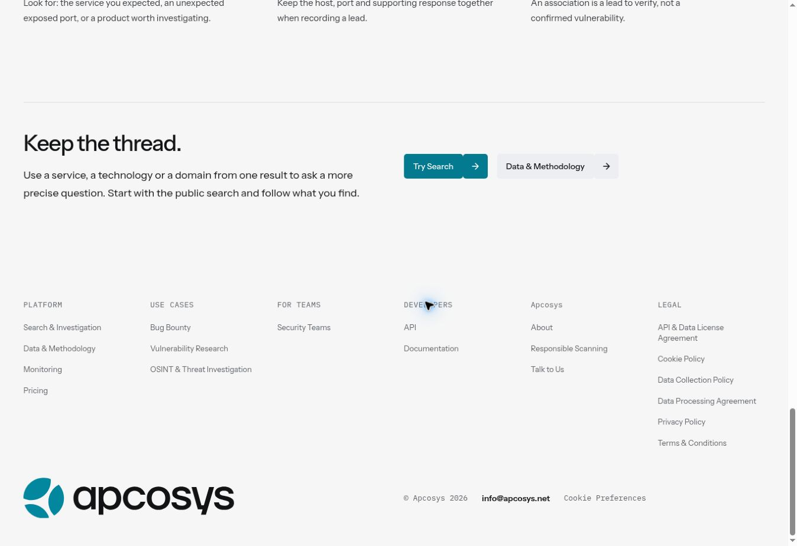
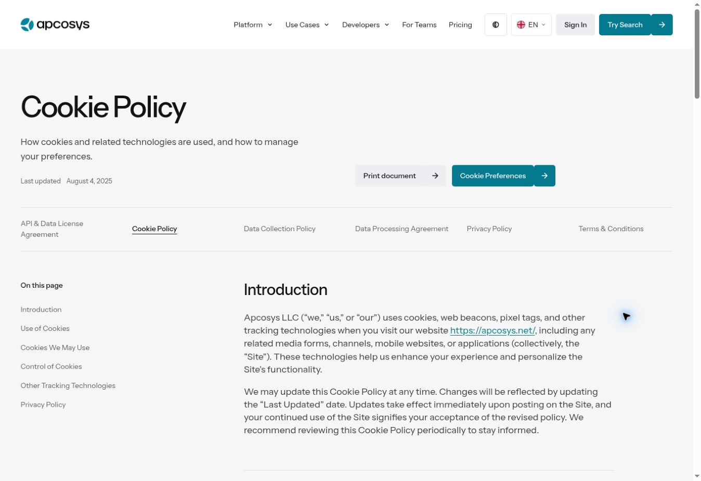
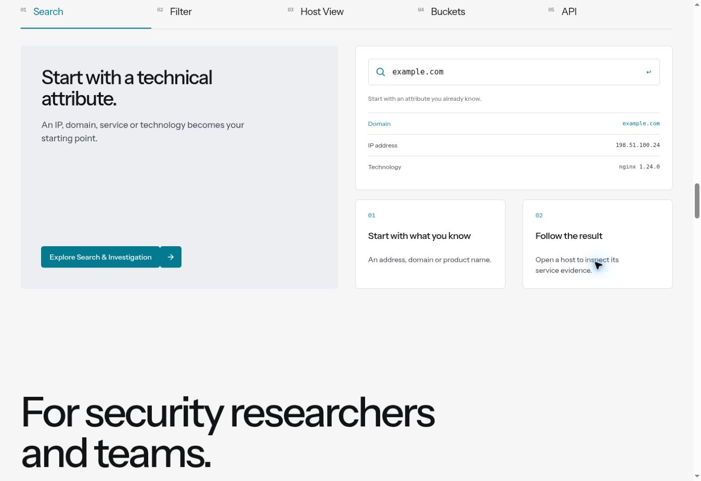
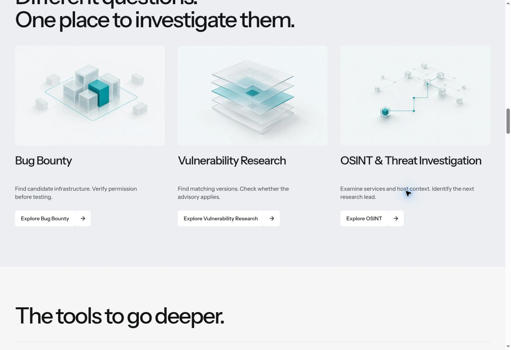
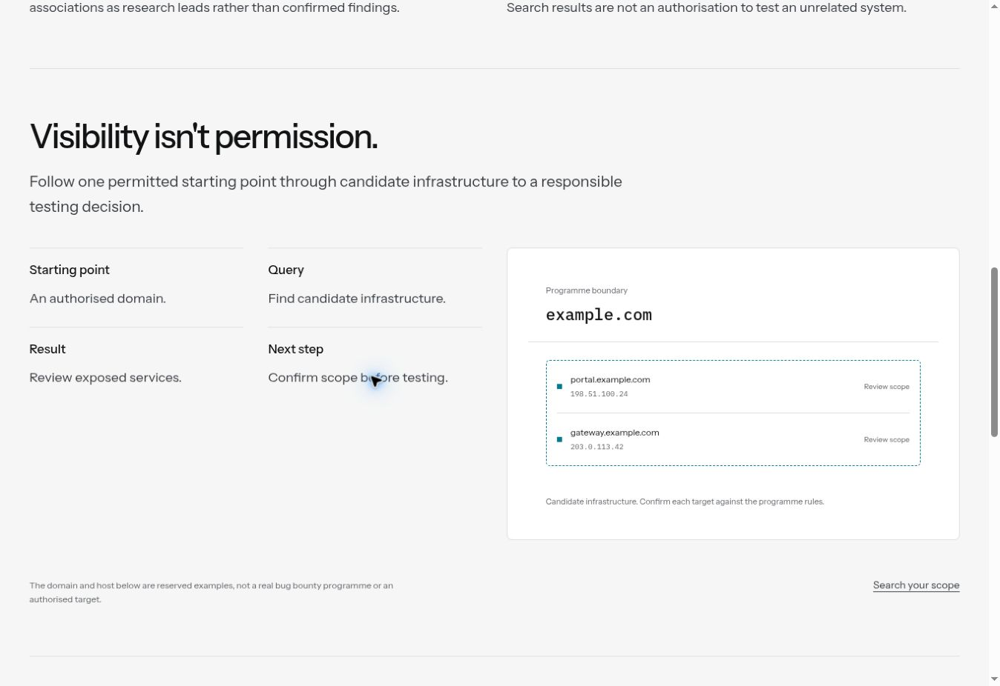

# R23 — повторная проверка внутренних колонок

Основание: скриншот пользователя от 10 октября, 14:36:54. На нём заключительный
блок Search & Investigation и футер имеют одинаковые внешние края, но разные
внутренние направляющие. Предыдущая проверка была недостаточной: совпадение
контейнеров не доказывает совпадение колонок.

## Что исправлено

| Участок                          | Причина                                                                                                                                       | Изменение                                                                                                                                                |
| -------------------------------- | --------------------------------------------------------------------------------------------------------------------------------------------- | -------------------------------------------------------------------------------------------------------------------------------------------------------- |
| Общий футер на всех 19 страницах | Собственные промежутки 20/24 px вместо общего 24–40 px; нижняя строка распределялась свободным flex                                           | Общий горизонтальный промежуток; нижняя строка использует половины сетки. На десктопе действия, Developers и метаданные начинаются на одной направляющей |
| Главная                          | Независимые промежутки в метриках, сценариях, карточках аудитории, тарифах и FAQ; произвольная пропорция блока возможностей                   | Общие направляющие для структурных колонок; возможности используют две равные половины, вложенные карточки — соответствующие четверти                    |
| Все шесть документов             | Меню документов имело собственный промежуток; планшетный текст начинался по отдельной пропорции; действия располагались по ширине содержимого | Меню и действия привязаны к общей сетке, текст на планшете начинается после первых четырёх колонок                                                       |
| Три сценария исследования        | Вложенные шаги имели фиксированный промежуток 24 px                                                                                           | Внутренняя половина делится тем же горизонтальным промежутком                                                                                            |
| Teams и About на телефоне        | Локальные переопределения 18/28 px                                                                                                            | Вертикальные расстояния сохранены, горизонтальные связаны с общим токеном                                                                                |

Проверка до исправления воспроизвела дефект: при ширине 1920 px начало четвёртой
колонки футера расходилось с правой половиной страницы на 10 px. Аналогичные
отклонения обнаружены у других структурных сеток. Изменены исходные правила
компонентов, без дополнительного глобального слоя переопределений.

Внутренние отступы белых сравнительных панелей, таблицы, интерфейсы примеров и
пять переключателей возможностей имеют собственную функциональную структуру.
Они не выдаются за колонки всей страницы. Тексты, палитра, иллюстрации и движки
GSAP не менялись.

## Объём проверки

Новый `column-rails.spec.ts` сравнивает реальные границы дочерних блоков с общей
12-колоночной сеткой, а не с промежутком самого проверяемого компонента.
Все 19 маршрутов проверяются при 320, 390, 768, 1024, 1199, 1200, 1440, 1920 и
2560 px. В проверку входят центральная направляющая, трети/четверти, вложенные
сетки, юридическая колонка и отсутствие горизонтального переполнения.

Отдельные существующие проверки покрывают внешние края, переносы и компактность
главной, строку почты/Cookies, юридический текст и печать, а также переключения и
воспроизведение оригинальных анимаций. Это автоматическая адаптивная проверка
Chromium; она не является утверждением о ручном просмотре каждой ширины в Safari.

## Визуальные свидетельства до исправления

1. Search: видны разные начала кнопок, Developers и нижних метаданных.
   
2. Cookie Policy: меню и текст документа имеют разные направляющие, блок действий
   расположен независимо от основной сетки.
   

## Проверенный результат

3. Search: действия, Developers и метаданные совпадают по X = 690.84375 px
   в текущем браузерном viewport. Нижняя строка остаётся горизонтальной.
   
4. Cookie Policy: начало Data Collection Policy и текста документа отличается
   только на округление 0.016 px; действия стоят на центральной направляющей.
   
5. Главная: одинаковая ширина левой и правой половин блока возможностей,
   совпадающие верх и низ; нижние карточки используют четверти общей сетки.
   
6. Главная: три равных колонки изображений, заголовков, описаний и действий.
   
7. Bug Bounty: вложенные шаги занимают четверти страницы; правый пример начинается
   на центральной направляющей. Текст не пересекается с примером.
   

Все эти кадры получены с новой Vercel-сборки. Отклонённые кадры с обрезанными
описаниями карточек не включены в набор. Визуальная проверка выполнена на десктопе;
остальные размеры проверены автоматически.

## Выполненные проверки и публикация

- 50/50 тестов Chromium прошли в одном итоговом прогоне:
  `column-rails`, `site-grid`, `legal-pages`, `compact-layout`, `stage2-motion`.
- Новая проверка колонок прошла на 19 маршрутах × 9 ширин.
- `npm run check`, обычная сборка и `npm run build:root` прошли.
- Начальный bundle: JS 308.4 KiB, CSS 97.4 KiB, в пределах существующих бюджетов.
- Vercel deployment `dpl_FT29yhZGMgR3azC5KuMToLKkDnDQ` — READY,
  точный коммит приложения `3c459affe58307d6f2c68d1ec3f294fcd844d904`.
- Preview: <https://apcoweb-stage2-review-i5bmiddpf-cdo-2844s-projects.vercel.app>.
- Изменения находятся в существующей ветке и draft PR #28. Последующая запись
  отчёта и скриншотов не меняет код приложения. Production и main не обновлялись.

Это проверка сеток и затронутого поведения, а не заявление о полной безошибочности
продукта или сертификации доступности.
