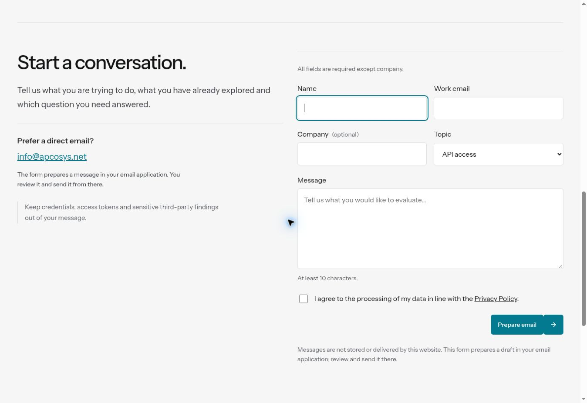
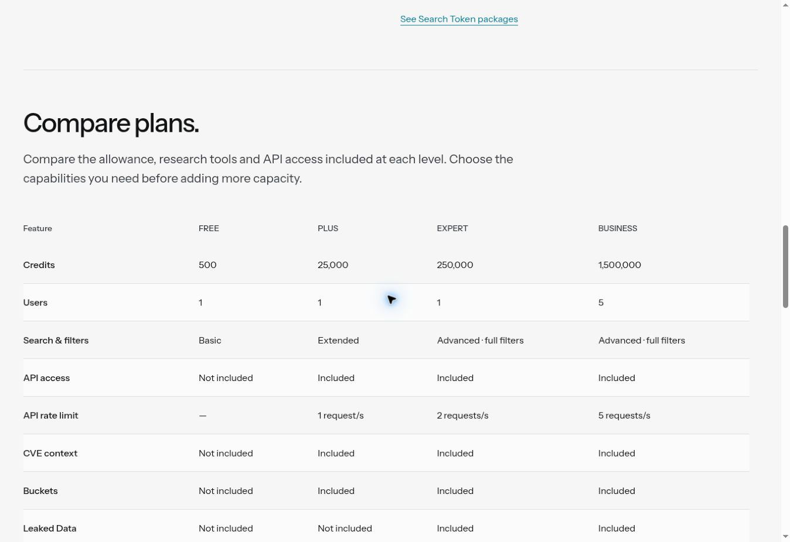
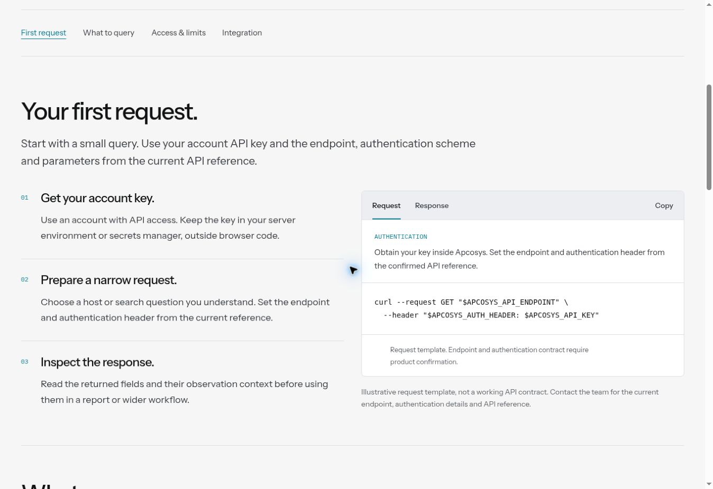
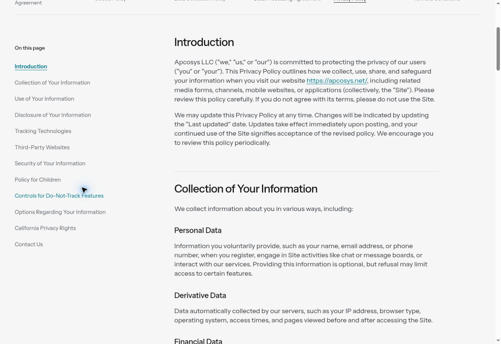

# R25 — восемь проходов аудита Apcosys

Дата: 10 октября 2026. Проверяемая версия приложения: `d82268b2374433c42bb97f9f709cede014b1d101`.

Результат: исправлены обнаруженные проблемы формы, навигации, сравнения тарифов и обратной связи API. Проверены общая сетка, правые границы действий и футера, типографика, первые экраны, компактность демонстраций и адаптивность. Согласованный визуальный язык сохранён: единый холодный фон, бирюзовый акцент, двойные кнопки, существующие изображения, GSAP-сцены и волна.

## 1. Сетка и правые границы

Кнопка отправки формы Contact стояла у левого края своей колонки. Теперь она закреплена справа. В браузере правая граница кнопки и формы совпадает: 1308 px. Проверки сетки охватывают 19 маршрутов на девяти ширинах от 320 до 2560 px. Правые границы завершающих CTA и нижней строки футера сохранены.

[До](r25-05-contact-before.jpg) · [После](10-contact-after.jpg)

## 2. Типографика и читаемость

Служебный текст формы увеличен с 12 до 14 px с межстрочным интервалом 1.6. Оглавление юридических документов увеличено с 14 до 15 px. Проверены ширина основного текста, иерархия заголовков, увеличенные пользовательские интервалы текста и светлая/тёмная темы. Сам юридический текст не переписан.

[До](r25-07-legal-before.jpg) · [После](13-legal-after.jpg)

## 3. Воздух и изменяемая высота

У формы появились самостоятельные пояснения обязательности полей и длины сообщения. Блок результата формы переведён на общий MorphPanel: появление статуса изменяет высоту плавно. Сохранены одинаковые первые экраны внутренних страниц и ритм отступов между разделами. Новые фоновые плашки и декоративные надзаголовки не добавлялись.

[Форма после изменений](10-contact-after.jpg)

## 4. Кнопки и обратная связь

Копирование API теперь показывает краткое подтверждение `Copied` и возвращается в исходное состояние. При запрете доступа к буферу код выделяется, состояние `Selected` сопровождается доступной инструкцией по ручному копированию. Ширина кнопки постоянная — соседние элементы не двигаются. При переключении Request/Response предыдущий статус сбрасывается; устаревшие асинхронные ответы не меняют новый экран.

[API до](r25-04-api-before.jpg) · [API после](12-api-after.jpg)

## 5. Переходы и клавиатура

Переходы по якорям внутри страницы теперь используют плавную прокрутку и передают фокус целевому разделу. При reduced motion прокрутка остаётся мгновенной. Исправлен Skip to content: он действительно переносит клавиатурный фокус за навигацию. Первоначальная загрузка якоря, история и переходы между страницами сохраняют существующую логику без второй прокрутки. Проверены переключения без наложения текста и ограничения анимаций.

## 6. Адаптивность и области нажатия

У ссылок оглавления и почты в футере минимальная высота нажатия 44 px. API-кнопка проверена на ширине 320 px. Проверены мобильные меню, горизонтальные переключатели, возврат к первому/последнему пункту клавиатурой и отсутствие перекрытия цены/CTA плавающим переключателем тарифов.

Внешний мягкий градиент поиска сохранён. Тест измеряет реальные поля, кнопки и выдачу отдельно от декоративного ореола: его намеренный выход на 4 px не считается обрезанным контентом.

[Сохранённая композиция поиска](01-search-before.jpg)

## 7. Содержание и пользовательский путь

На Pricing кнопка подробного сравнения ведёт к полной таблице на этой же странице. Убран лишний шаг с дублирующим сокращённым диалогом; диалог на главной сохранён. `View Business Plan` ведёт сразу к соответствующему тарифу. Подсказка горизонтального свайпа не показывается на широком экране.

В Contact явно отмечено необязательное поле Company; сообщение проверяется после удаления пробелов по краям. Ошибка переводит фокус на нужное поле. Форма по-прежнему честно объясняет, что готовит письмо в почтовом приложении, а не отправляет данные через несуществующий backend.

[Дублирующий диалог до](r25-03-pricing-dialog-before.jpg) · [Полная таблица после](11-pricing-after.jpg)

## 8. Проверка выпуска и сохранность изменений

Добавлены 11 проверок обнаруженных сценариев. Создана команда `npm run test:release` для текущего Stage 2: общие функциональные проверки, все маршруты, сетки, чтение, доступность, изображения, шрифты и анимации. Этот набор используется до и после публикации Pages.

Исторические R21-тесты и пиксельные эталоны не переписаны. Они остаются в репозитории, но не являются контрактом нового Stage 2. Старое ожидание видимого billing dock заменено проверкой текущего утверждённого поведения: dock не перекрывает цену или кнопку. Обновлены устаревшее имя CTA в проверке header, ожидание загрузки ленивого hero и измерение содержимого поиска отдельно от внешнего ореола. Порог проверки реального переполнения не ослаблен.

Из текущего main сохранена отдельная правка заголовка `Have specific requirements?`. Main включён в историю рабочей ветки до переноса результата.

## Проверки и границы аудита

- Базовая проверка перед изменениями: 47/47 — геометрия 19 маршрутов на девяти ширинах и доступность/ресурсы всех маршрутов в двух темах.
- Итоговый набор: 244 сценария. Первый полный прогон: 230 прошли, 14 выявили описанные выше несовпадения тестового контракта. После исправления тестов: повторные прогоны 10/14 и 4/4; все 244 сценария имеют успешный результат. Повторно весь набор локально не запускался.
- Все 11 новых R25-сценариев прошли в полном прогоне.
- В браузере вручную осмотрены главная, поиск, Pricing, API, Contact, Monitoring, Teams и юридическая страница. Все 19 маршрутов проверены автоматически; ручной просмотр каждой комбинации маршрута и размера не заявляется.
- Автоматическая геометрия проверена на 320, 390, 768, 1024, 1199, 1200, 1440, 1920 и 2560 px. Сохранённые ручные скриншоты сделаны на desktop.
- Этот выпуск проверен в Chromium. Отдельный новый прогон Firefox/Safari не проводился.
- Vercel-превью приложения имеет статус READY. Финальные изменения после этого деплоя касаются тестов и отчёта.
- Остаются прежние продуктовые ограничения: точный sign-in URL и API-контракт требуют подтверждения, Monitoring обозначен как концепция, Contact готовит письмо. Аудит интерфейса не подменяет проверку backend и юридическую экспертизу.

## Визуальные свидетельства

Все изображения в этой папке сняты в текущем проходе. Файлы `before` показывают исходную версию; `10`–`13` — опубликованный результат R25. Изображения не являются сгенерированными макетами.

